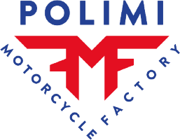

<!-- <div align="center">
  
  <h1>pmf telemetry project</h1>
  <p><strong>candidato:</strong> gianluca meneghetti</p>
</div>

--- -->

## 🇮🇹 Versione Italiana

> [!NOTE]
> **il contesto:**
> durante il test tecnico scritto non ho saputo rispondere con sicurezza alle domande su **infrastruttura (nas)** e **protocolli di rete (tcp vs udp)**.
>
> non mi piace lasciare i problemi irrisolti. essendo uno studente lavoratore abituato a un approccio pratico, ho passato gli ultimi 3 giorni a studiare questi concetti e ad applicarli in questo progetto software, per dimostrare di aver colmato le lacune.

### Di cosa si tratta

È una suite completa per la gestione e l'analisi della telemetria, pensata per un ingegnere di pista che deve lavorare velocemente nel box.

Il progetto tocca quattro punti fondamentali che uniscono l'informatica alle corse:

1. **data offload (la rete):** simulazione dello scarico dati dalla centralina al pc.
2. **data analysis (i dati):** visualizzazione e studio della telemetria (con dati reali).
3. **infrastruttura (il deploy):** ambiente containerizzato e replicabile.
4. **AI driving analysis (il machine learning):** classificazione non supervisionata dello stile di guida.

### Come ho ragionato

#### 1. infrastruttura e NAS

Non sapendo configurare un NAS fisico da zero, ho risolto il problema a monte usando **docker**.

Ho configurato dei *docker volumes* che permettono ai dati di persistere e di essere condivisi tra container e macchina host, simulando di fatto un archivio di rete accessibile a tutto il team, indipendentemente dal sistema operativo usato.

#### 2. TCP vs UDP nel motorsport

Ho implementato un simulatore di rete per capire la differenza pratica.

> [!IMPORTANT]
> **riferimento regolamento motostudent b.10.3.3**
> 
> la telemetria live è vietata. lo scarico dati è consentito solo via cavo a moto ferma.

Per questo motivo, nel tool vedrete che l'uso di **udp** (veloce ma senza controlli) porta a file corrotti, mentre il **tcp** (più lento ma con handshake) garantisce l'integrità del dato, fondamentale per l'ingegneria.

#### 3. Dati reali e fisica

Non volevo usare numeri casuali. Ho scaricato la telemetria della **f1 al mugello 2020** (leclerc) tramite le api di fastf1.

Poiché una f1 non è una moto, ho scritto un algoritmo di pulizia dati usando **polars**:

* ho traslato le marce (da 8 a 6).
* ho clippato i giri motore a 14.000 (limite regolamento cat. petrol).
* **fisica inversa:** non avendo accelerometri nel dataset, ho derivato matematicamente le forze g (longitudinale e laterale) partendo dalla cinematica del gps per creare il diagramma g-g.

#### 4. AI Driving Coach (Clustering K-Means)
Non mi sono fermato alla fisica. Volevo un'analisi oggettiva dello stile di guida, qualcosa che andasse oltre il "sentimento" del pilota per trovare i decimi nascosti.

**L'idea:** usare il clustering (un algoritmo di machine learning non supervisionato, il K-Means) per raggruppare i dati telemetrici in "fasi di guida" distinte. L'algoritmo non sa cosa sia una "staccata", ma analizzando variabili chiave come `velocità`, `throttle`, `freno` e `forze G`, crea dei cluster che corrispondono ai momenti precisi del giro.

Il risultato è una mappa che colora ogni punto del tracciato in base alla fase di guida rilevata dall'AI:
*   **Staccata Violenta**
*   **Trail Braking**
*   **Coasting (perdita di tempo)**
*   **Accelerazione in uscita**
*   **Full Gas**

Questo permette all'ingegnere di vedere subito dove il pilota perde tempo (es. troppo *coasting* a centro curva) e confrontare i giri in modo oggettivo.

### Stack tecnologico

Ho scelto strumenti moderni basati su **rust** per avere le massime performance nella gestione di log pesanti:

* **uv:** package manager istantaneo (sostituisce pip).
* **polars:** libreria dataframe multithreaded (molto più veloce di pandas).
* **streamlit:** per creare l'interfaccia grafica senza perdere tempo in html/css.
* **plotly:** per i grafici interattivi e la mappa 3d.

### Quick start

Non serve installare python o librerie sul proprio pc. Basta avere docker.

1. clonare la repository.
2. lanciare tutto con un comando:

```bash
docker compose up --build
```

3. aprire il browser su `http://localhost:8501`.

---

> [!TIP]
> **per testare il simulatore**
> 
> nell'app, vai sulla sezione **"1. data offload"**, selezionare il protocollo tcp e avviare il download. Solo dopo aver ottenuto il file integro si sbloccheranno i grafici di analisi.

---

## 🇬🇧 English Version

> [!NOTE]
> **the context:**
> during the written technical test, I couldn't answer confidently the questions about **infrastructure (nas)** and **network protocols (tcp vs udp)**.
>
> I don't like leaving problems unsolved. being a working student accustomed to a practical approach, I spent the last 3 days studying these concepts and applying them in this software project, to demonstrate that I've filled the gaps.

### What it is

It's a complete suite for telemetry management and analysis, designed for a track engineer who needs to work quickly in the pit box.

The project touches four fundamental points that unite computer science with racing:

1. **data offload (networking):** simulation of data download from the ecu to the pc.
2. **data analysis (data):** visualization and study of telemetry (with real data).
3. **infrastructure (deployment):** containerized and replicable environment.
4. **AI driving analysis (machine learning):** unsupervised classification of driving style.

### How I reasoned

#### 1. infrastructure and NAS

Not knowing how to configure a physical NAS from scratch, I solved the problem at its root using **docker**.

I configured *docker volumes* that allow data to persist and be shared between containers and host machine, effectively simulating a network storage accessible to the entire team, regardless of the operating system used.

#### 2. TCP vs UDP in motorsport

I implemented a network simulator to understand the practical difference.

> [!IMPORTANT]
> **motostudent regulation reference b.10.3.3**
> 
> live telemetry is prohibited. data download is only allowed via cable with the motorcycle stopped.

For this reason, in the tool you'll see that using **udp** (fast but without controls) leads to corrupted files, while **tcp** (slower but with handshake) guarantees data integrity, fundamental for engineering.

#### 3. Real data and physics

I didn't want to use random numbers. I downloaded the **f1 mugello 2020** telemetry (leclerc) through the fastf1 api.

Since an f1 car is not a motorcycle, I wrote a data cleaning algorithm using **polars**:

* I shifted the gears (from 8 to 6).
* I clipped the engine rpm to 14,000 (petrol category regulation limit).
* **inverse physics:** not having accelerometers in the dataset, I mathematically derived the g-forces (longitudinal and lateral) starting from gps kinematics to create the g-g diagram.

#### 4. AI Driving Coach (K-Means Clustering)
I didn't stop at physics. I wanted an objective analysis of driving style, something that goes beyond the driver's "feel" to find those hidden tenths of a second.

**The idea:** use clustering (an unsupervised machine learning algorithm, K-Means) to group telemetry data into distinct "driving phases". The algorithm doesn't know what "braking" is, but by analyzing key variables like `speed`, `throttle`, `brake`, and `G-forces`, it creates clusters that correspond to specific moments of the lap.

The result is a map that colors each point of the track based on the driving phase detected by the AI:
*   **Hard Braking**
*   **Trail Braking**
*   **Coasting (time loss)**
*   **Corner Exit / Acceleration**
*   **Full Throttle**

This allows the engineer to immediately see where the driver is losing time (e.g., too much *coasting* mid-corner) and to compare laps objectively.

### Technology stack

I chose modern tools based on **rust** to have maximum performance in handling heavy logs:

* **uv:** instant package manager (replaces pip).
* **polars:** multithreaded dataframe library (much faster than pandas).
* **streamlit:** to create the graphical interface without wasting time on html/css.
* **plotly:** for interactive charts and 3d map.

### Quick start

No need to install python or libraries on your pc. Just have docker.

1. clone the repository.
2. launch everything with one command:

```bash
docker compose up --build
```

3. open the browser at `http://localhost:8501`.

---

> [!TIP]
> **to test the simulator**
> 
> in the app, go to the **"1. data offload"** section, select the tcp protocol and start the download. Only after obtaining the intact file will the analysis charts be unlocked.
